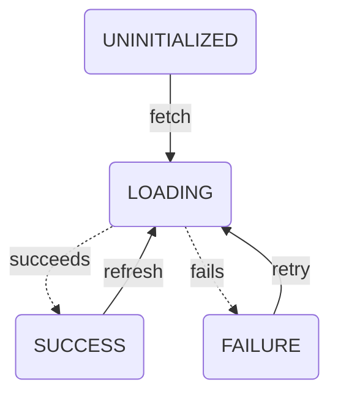

# Scaling State: Synced State (WIP)

Devon Coleman | Published 7/25/25

In the [prior entry](./types.md), I defined synced state as:

> state that needs to be synchronized from/to some other source — the client (the user's browser) is **not** the source of truth

This definition is intentionally broad. While most discussion on this topic names this concept "server state", I think that misses the fundamental distinction between synced and client state — the client fully owns client state, but does not wholly own synced state.

It's definitely true that the client doesn't own server state though, so server state is a type of synced state — I just think it's valuable to capture that the patterns for keeping a value in IndexedDB can (and should) be the same as keeping a value in a server.

## Patterns for Synced State

So let's discuss those patterns!

### Lifecycle

First and foremost, synced state has a lifecycle that we use to model the process of syncing it into the client. In my prior post, I illustrated it with this diagram:



There are four possible statuses for synced state to be in:

- `UNINITIALIZED`: The state has not been requested
- `LOADING`: A request has been fired, but has not yet resolved
- `SUCCESS`: A request succeeded and the data is ready to be used
- `FAILURE`: A request failed and the data is not present

The transitions between states are generally pretty simple:
- If `UNINITIALIZED`, fetch and set to `LOADING`
- On success, set to `SUCCESS`
  - If resync needed, fetch and go to `LOADING`
- On failure, set to `FAILURE`
  - If desired, fetch (retry) and go to `LOADING`

Generally, the React community seems to have settled on collapsing these statuses into a few values, typically returned from a hook:

```ts

const {
    data,
    loading,
    error
} = useThing();

```

where:
- `data`: populated if `status` === `SUCCESS`
- `loading`: `true` if `status` === `UNINITIALIZED` | `LOADING`
- `error`: an `Error` (or `true`) if `status` === `FAILURE`


This state machine and set of fields is relatively simple, and if this is all we had to do, I doubt synced state would be as big an issue as it is.

All of the additional complexity in managing synced state comes when answering a few questions:
1. How do we handle failures? (fault tolerance)
2. When do we need to refresh our copy of the data? (cache invalidation)

### How do we handle failures?