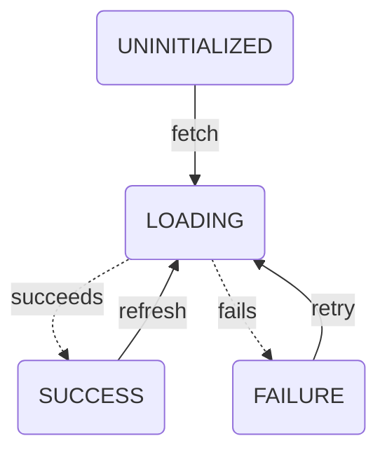

# Scaling State: Synced State

Devon Coleman | Published 7/25/25

In the [prior entry](./types.md), I defined synced state as:

> state that needs to be synchronized from/to some other source — the client (the user's browser) is **not** the source of truth

This definition is intentionally broad. While most discussion on this topic names this concept "server state", I think that misses the fundamental distinction between synced and client state — the client fully owns client state, but does not wholly own synced state.

It's definitely true that the client doesn't own server state though, so server state is a type of synced state — I just think it's valuable to capture that the patterns for keeping a value in IndexedDB can (and should) be the same as keeping a value in a server.

## Patterns for Synced State

So let's discuss those patterns!

### Lifecycle

First and foremost, synced state has a lifecycle that we use to model the process of syncing it into the client. In my prior post, I illustrated it with this diagram:



There are four possible statuses for synced state to be in:

- `UNINITIALIZED`: The state has not been requested
- `LOADING`: A request has been fired, but has not yet resolved
- `SUCCESS`: A request succeeded and the data is ready to be used
- `FAILURE`: A request failed and the data is not present

(Note: this is the bare minimum set of states. There may be more and/or different transitions depending on your use case)

The transitions between states are pretty simple:

- If `UNINITIALIZED`, fetch and set to `LOADING`
- On success, set to `SUCCESS`
  - If resync needed, fetch and go to `LOADING`
- On failure, set to `FAILURE`
  - If desired, fetch (retry) and go to `LOADING`

### Consumption

Once the lifecycle is defined and properly managed in your state system of choice, we have to decide how to consume the state + lifecycle in our app. 

Generally, the React community seems to have settled on collapsing these four statuses (+ the data/error) into a few values, typically returned from a hook:

```ts

const {
    data,
    loading,
    error
} = useThing();

```

where:
- `data`: populated if `status` === `SUCCESS`
- `loading`: `true` if `status` === `UNINITIALIZED`/`LOADING`
- `error`: an `Error` (or `true`) if `status` === `FAILURE`

I believe this abstraction is effective and durable. In a React context, it makes it trivially easy to switch behavior based on state:

```tsx

const { data, loading, error } = useThing();

if (error) {
  return <ErrorState error={error} />;
} else if (loading) {
  return <LoadingState />;
} else {
  return <Presentation data={data} />
}

```

Exposing an independent `status` field makes the checks unnecessarily verbose, and folks generally have different names for some of the states (`LOADING` vs `PENDING`, etc). In an enterprise context, this can get quite confusing when multiple sets of constants are used (ask me how I know).

Time and time again, I've seen folks try different things and settle on this pattern — at this point, I'm willing to call it essential complexity. It maps very well to how developers conceptualize synced state and seems to cover *most* of our bases well (more on this later..).

### Initialization

Looking at the api of `useThing()`, you won't see a way to initiate the load (i.e transition from `UNINITIALIZED` to `LOADING`).

This is typically implicitly done by calling the hook. Internally (if managed via redux), you'd expect the hook to (naively) look something like this:

```ts
export const useThing = () => {
  const status = useSelector(getThingStatus);
  const data = useSelector(getThingData);
  const error = useSelector(getThingError);

  const dispatch = useDispatch();

  useEffect(() => {
    if (status === 'UNINITIALIZED') {
      dispatch(fetchThing());
    }
  }, [status, dispatch]);

  return useMemo(() => ({
    loading: status === 'UNINITIALIZED' || status === 'LOADING',
    error: error ?? null,
    data,
  }), [status, data, error]);
}
```

An effect fires the load if it hasn't been fired yet. Easy! But what if we want to wait?

Typically, this is accomplished by having the hook consume a `skip` parameter:

```ts
export const useThing = ({
  skip = false,
}: {
  skip?: boolean
}) => {
  /* redux glue */

  useEffect(() => {
    if (status === 'UNINITIALIZED' && !skip) {
      dispatch(fetchThing());
    }
  }, [status, skip, dispatch])

// rest of hook
```

Other parameters (inputs to the load, such as an identifier) should also be passed via this options object.

Some may wish to split it into two objects, one for load params and one for load options — I find this to be unnecessary, but so long as you pick a style and stick to it, this type of change is super easy to back out.

You *can* use positional params, but in my experience named params are significantly more durable, self-documenting, and easy to maintain over time.

#### Beware Over-Abstraction

Quick side-note. If you're writing this type of hook yourself, it's incredibly tempting to build a general-purpose hook factory that consumes a set of selectors/actions and produces a data fetching hook.

This type of abstraction is rarely worth the cost. This basic hook recipe is functional, but there are so many potential variations and tweaks you may want to make per-thing that you won't get nearly as much mileage out of the abstraction as you might think.

This is a case where a bit of repetition is far preferable to a maze of switches and edge cases.

Of course, YMMV. This is simply my experience.

### Additional Actions

You'll also note that our current api doesn't provide a way to refresh the state.

The most effective approach I've seen for this is to expose a `refresh` method on the object returned by the hook. Just ensure it  is properly memoized (separately from the data) and you're good to go. Take a read through [useEffect considered harmful?](../misc/references.md) for some context on my thoughts about references.

For completeness' sake, here's what our fully-built data fetching hook would look like:

```ts
export const useThing = ({
  thingId,
  skip = false,
}: {
  thingId: string,
  skip?: boolean
}) => {
  // assume curried selectors
  const status = useSelector(getThingStatus(thingId));
  const data = useSelector(getThingData(thingId));
  const error = useSelector(getThingError(thingId));

  const dispatch = useDispatch();

  const refetch = useCallback(
    (id: string) => dispatch(fetchThing(id)),
    [dispatch]
  );

  useEffect(() => {
    if (status === 'UNINITIALIZED') {
      refetch(thingId);
    }
  }, [thingId, status, refetch]);

  return useMemo(() => ({
    loading: status === 'UNINITIALIZED' || status === 'LOADING',
    error: error ?? null,
    data,
    refetch
  }), [status, data, error]);
}
```

## Complexity

This state machine and set of fields is relatively simple, and if this is all we had to do, I doubt synced state would be as big an issue as it is.

All of the additional complexity in managing synced state comes when answering a few questions:

1. How do we handle failures? (fault tolerance)
2. When do we need to refresh our copy of the data? (cache invalidation)

So that's what we'll be tackling next!

[Back to home](../index.md) | Next — Scaling State: Synced State Fault Tolerance(Coming soon!)