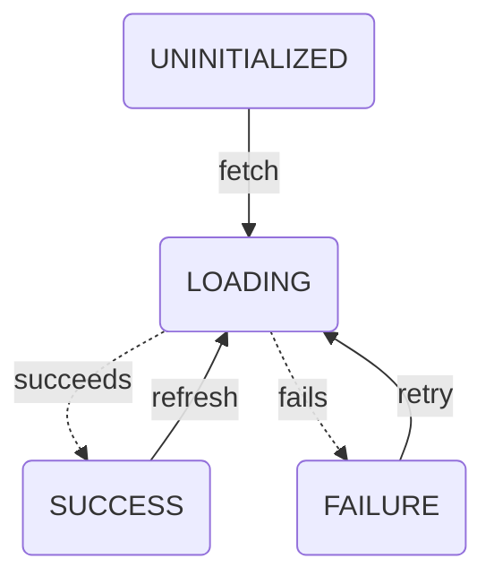

# Scaling State: Types of State

Devon Coleman | Published 7/11/25

There are two distinct classes of state typically encountered when building a sufficiently-complex FE webapp. Let's talk about them!

## Synced state

Synced state (as the name suggests) is state that needs to be synchronized from/to some other source. This is also often referred to as "server state", but I think that term fails to encapsulate state that is synced to some other location (like IndexedDB) and should use the same patterns.

The typical characteristics of synced state are:
- Once read, the data exists both in memory and a remote store
- The data is generally (but not always) read/written with async flows

Synced state nearly always necessitates tracking metadata about the state. We need to track things like "Has it been read?" or "Is the read in-flight?" or "Did the read fail?"

Often you'll see this as a "status" field with `UNINITIALIZED`/`LOADING`/`SUCCESS`/`FAILURE` values, or (more commonly) `data`/`error`/`loading` fields (such as provided by Apollo).

### Synced state's lifecycle

Regardless of how it is presented, this metadata generally lets us track and react to the "lifecycle" of synced state. The lifecycle is generally represented by a deceptively simple state machine:

This lifecycle is generally consistent for any piece of synced state, which leads people to think they can easily write an abstraction for it.

Sadly it's much more complex than it seems, so most of the things people write are bad. As a sneak peek of the future: This is where a metric ton of accidental complexity sneaks in.

## Client state

In constrast, client state is everything an app tracks that doesn't fall into the synced state category.

The typical characteristics of client state are:
- The data (usually) only exists in memory and is not durable
- The data is generally read/written with sync flows

As a rule of thumb, client state is used to manage or react to user interactions. Think "what is the value of this text field? or "is this dropdown open?".

### Client state's location

The complexity with client state generally comes from deciding where to keep it. In a React app (the context for all of these discussions, as my day job is a React shop), there are three typical "levels" of state that define how broadly it reaches across the component tree:

- Component state: Stays local to this component + its children
- Context: Broadly shared across the context providers' subtree
- Global state: Globally shared across the app (usually something like redux, zustand, jotai)

Generally, I recommend starting at the lowest level possible (component state) and "hoisting" the state to higher levels as it becomes needed across more of the tree.

## And Never the Twain Shall Meet

Do not mix client and synced state.

Synced state and client state should not be stored together.

If you store synced and client state in the same place, you're in for a bad time.

Client + Synced state = pain.

Very, very often, developers want to put their client and synced states in the same container. Whether this is using redux for everything, or using reactive variables in apollo client, they want to "reduce complexity" by standardizing on a single source of truth for app state. But I'm here to say that this is in fact an antipattern and should not be done under any circumstances.

The reasoning is both simple and deep: The two types of state have very different needs, concerns, challenges, and opportunities. Trying to mix them inevitably results in problems because a pattern built for one type won't cleanly work with another.

It also tightly couples your client state patterns with your synced state patterns. If you need to swap one out (moving your synced state into graphql, for example — extremely common in enterprise apps), you will find it very difficult unless you've correctly separated your concerns.

In the React world, the right way to combine these types of state is at the component layer, which frequently means a properly memoized custom hook.

In my experience, much of the accidental complexity in FE apps comes when synced state gets involved — so next up, we'll be digging deeper into that.

[Back to home](../index.md) | Next (Coming soon!)